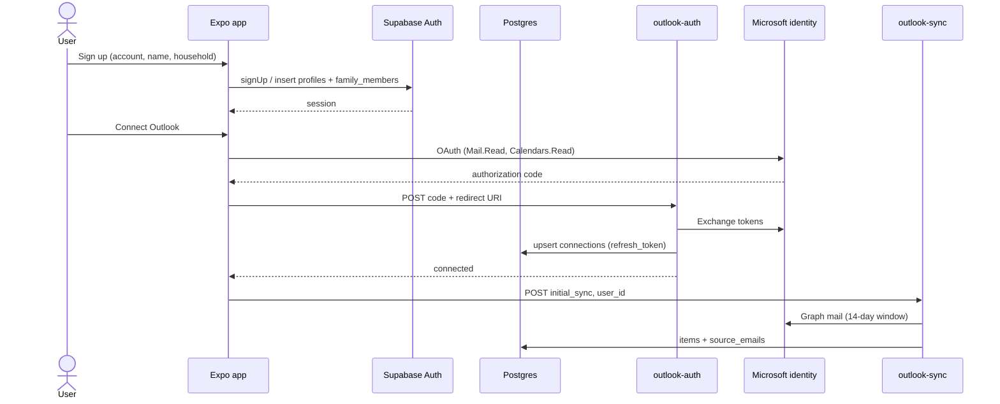
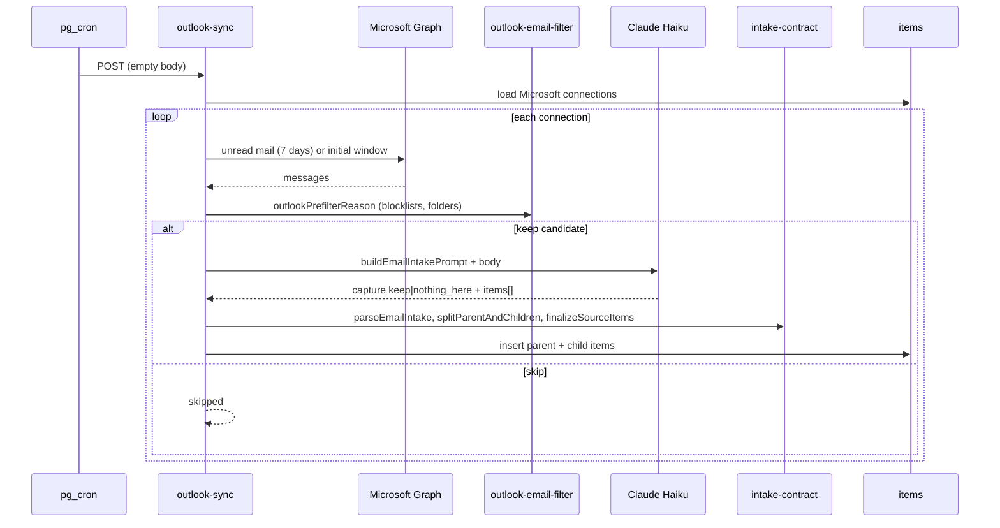
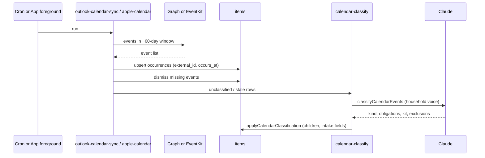
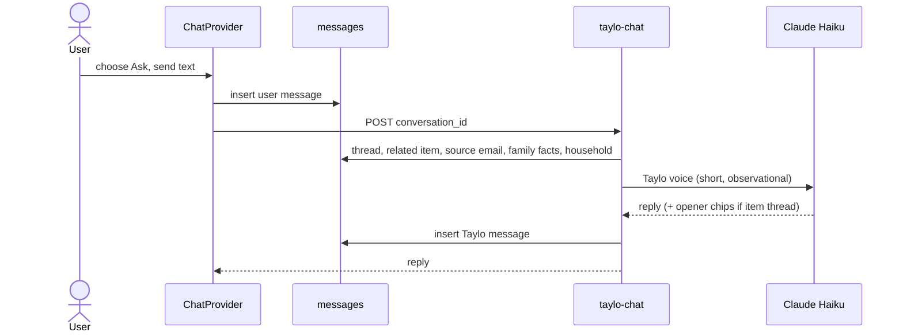
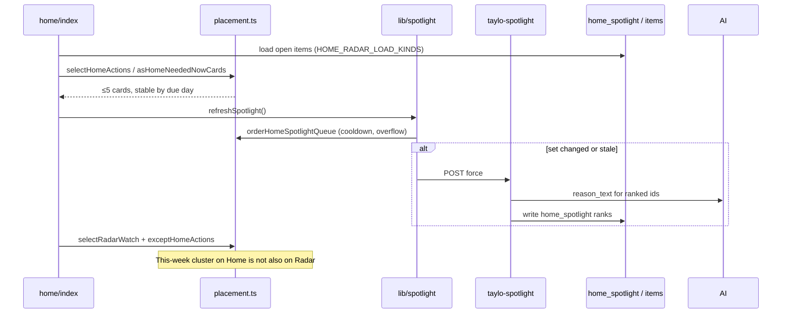
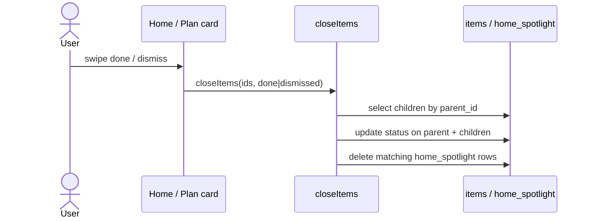

# Taylo architecture

Taylo is a family-admin app: it captures what is happening (email, calendar, chat), stores one canonical **item** graph, then places those items onto a small set of surfaces so the user sees the next useful action — not an inbox dump.

The product is an **Expo (React Native) client** plus **Supabase** (Auth, Postgres, Edge Functions). Classification and copy use Anthropic Claude. There are almost no OOP classes; the “core classes” below are the typed contracts and modules that every path shares.

---

## Overview

**Job of the app.** Hold school, medical, activity, and household admin for a UK household. The parent should see:

- **Home** — up to five near-term *actions* (forms, RSVPs, payments, dated errands, this-week events with open work).
- **Radar** — holds, far-dated admin, packing grouped under a parent, and named lists (Shopping, General to do, user-created lists).
- **Schedule** — things that actually happen (`occurrence` / dated `context_only`).
- **Family** — who it affects this week.
- **Ask / Offload** — chat: either answer a question, or persist a capture into items.

**Design rule.** Capture the *kind* at ingest. Placement (not the source, not the UI card) decides the surface. `source` is provenance only (`email` | `chat` | `manual` | `calendar`). One real-world cluster is one card: a this-week gala with a medical form and kit is one Home card, not a form card plus a Radar kit group.

**Canonical kinds** (`items.kind`):

| Kind | Meaning |
|---|---|
| `occurrence` | Something that happens. Calendar always. Email/chat when they named a real event and an unambiguous day. `occurs_at` required. |
| `obligation` | A concrete action (form, RSVP, packed lunch). `due_at` if dated. |
| `hold` | Awareness, no deadline (`due_at` null). |
| `list_item` | A line on Shopping / General to do / a named list. |
| `context_only` | Useful fact, no action (nursery closed). |

Children hang off a parent via `parent_id`. Closing a parent closes open children.

---

## How the pieces fit together

```
                    ┌─────────────────────────────────────────┐
                    │              Capture                    │
                    │  Outlook mail · Outlook/Apple cal · Chat│
                    └───────────────┬─────────────────────────┘
                                    │ Claude + intake contract
                                    ▼
                    ┌─────────────────────────────────────────┐
                    │         Postgres `items`                │
                    │  + collections, conversations, spotlight│
                    └───────────────┬─────────────────────────┘
                                    │ placement.ts
                    ┌───────────────┼───────────────┐
                    ▼               ▼               ▼
                 Home            Radar           Schedule
              (spotlight)     (watch+lists)    (occurrences)
                    │               │               │
                    └───────────────┴───────────────┘
                                    ▼
                         Expo screens + ChatProvider
```

**Client (`app/`, `components/app/`, `lib/`)**  
File-based Expo Router. Tabs: Home, Plan (Radar / Schedule / Family), Ask, More. The client reads `items` with RLS, maps rows to cards (`plan-item-map`), and invokes Edge Functions when it needs AI or Microsoft tokens.

**Shared domain (`supabase/functions/_shared/`)**  
The same TypeScript modules are imported by Edge Functions *and* re-exported from `lib/` so Home/Radar behaviour cannot drift from ingest. Placement, intake, shopping, collections, calendar classify, and household voice live here.

**Edge Functions (`supabase/functions/`)**  
Deno handlers: ingest, classify, chat, spotlight, noticed, family-week, schedule-density, Microsoft OAuth/sync. Cron (`pg_cron` + `pg_net`) runs Outlook email and calendar sync.

**Postgres**  
`items` is the system of record. Supporting tables: `collections`, `conversations` / `messages`, `connections`, `profiles` / `family_members` / `family_facts`, `home_spotlight`, `home_noticed`, `source_emails`.

---

## App surfaces and routing

| Route | Role |
|---|---|
| `app/index.tsx` | Splash: sign up / sign in |
| `app/signup.tsx`, `app/signin.tsx` | Auth + household onboarding |
| `app/(tabs)/home` | Today's actions, family strip, noticed insight, happening |
| `app/(tabs)/home/today.tsx` | “See all” — rest of the same Home pool, not Radar leftovers |
| `app/(tabs)/plan` | Radar hub: lists + watch cards |
| `app/(tabs)/plan/today.tsx`, `month.tsx`, `later.tsx` | Schedule views |
| `app/(tabs)/plan/person/[personId].tsx` | Family member week |
| `app/(tabs)/plan/item/[itemId].tsx` | Item detail |
| `app/(tabs)/plan/list/[collectionId].tsx` | Named list |
| `app/(tabs)/chat.tsx` | Ask / Offload |
| `app/(tabs)/more/*` | Settings, family, connections (Outlook + Apple Calendar) |

`ChatProvider` wraps the tab shell so any screen can open a thread on an item.

---

## Sequence diagrams

### 1. Sign up and connect Outlook



### 2. Email ingest (scheduled or initial)



Holds stay undated. Stated kit lines persist with `due_at` null (do not copy the event day). “No gifts” drops Present/Card. Interviews get `obligations: []`.

### 3. Calendar sync (Outlook cron or Apple on device)



Apple Calendar: `lib/apple-calendar.ts` reads EventKit on a dev build, upserts `source=calendar`, then calls the `calendar-classify` function. Expo Go / web cannot read EventKit.

### 4. Offload (chat capture)

```mermaid
sequenceDiagram
  actor User
  participant Chat as ChatProvider
  participant DB as conversations / messages
  participant Off as taylo-offload
  participant AI as Claude Haiku
  participant Shop as shopping + collections
  participant Contract as intake-contract
  participant Spot as refreshSpotlight

  User->>Chat: choose Offload, send text
  Chat->>DB: insert user message
  Chat->>Off: POST conversation_id
  Off->>DB: load thread + household
  Off->>AI: extract items (intake contract)
  AI-->>Off: items[], checklist, reply
  Off->>Contract: splitParentAndChildren, finalizeSourceItems
  alt groceries only
    Off->>Shop: Shopping collection, list_item
  else mixed or non-grocery
    Off->>Shop: split: Shopping + General to do
  end
  Off->>DB: insert items, Taylo reply
  Off-->>Chat: reply, item_id
  Chat->>Spot: refreshSpotlight()
```

Chat/manual undated and dated chores go on General to do. Named dated life events from chat (`isNamedDatedLifeEventCapture`) are `occurrence` (not list-bound) plus child obligations. Mixed “oat milk and email the teacher” splits. “Book the eye test” is a todo even if it contains “book”.

### 5. Ask (chat, no persist)



Opening a Home card uses `openItem` → `taylo-chat` with `opener: true` for a first line and chips.

### 6. Home spotlight and Radar placement



**Home eligibility (summary):** dated admin due today, overdue, or within 7 days; this-week event with open work folds form + kit into **one** parent card. Cap 5. Rank only with `compareHomeActions`. Visiting Home must not swap two valid cards.

**Radar:** holds; packing under a live parent that is *not* already on Home; far-dated overflow. List-bound items (`collection_id`, `kind=list_item`, or parent has a collection) sit on lists, not as bare Radar cards. Children of dismissed/done parents stay off both surfaces.

### 7. Complete or dismiss an item



---

## Overall architecture

### Client layer

| Module | Responsibility |
|---|---|
| `lib/supabase.ts` | Anon Supabase client (session + RLS) |
| `components/app/ChatProvider.tsx` | Conversation state; routes send → `taylo-chat` or `taylo-offload` |
| `lib/spotlight.ts` | When to regenerate Home cache; calls `taylo-spotlight` |
| `lib/noticed.ts` | Home insight cache; calls `taylo-noticed` |
| `lib/apple-calendar.ts` | EventKit sync, background fetch, classify batch |
| `lib/collections.ts` | Shopping / General to do / named lists |
| `lib/plan-item-map.ts` | DB row → `PlanItemCardModel` |
| `lib/schedule.ts` | Agenda grouping for Plan Schedule |
| `lib/family-week.ts` | Cached weekly blurbs; calls `taylo-family-week` |
| `lib/item-status.ts` | Close parent + children |
| `lib/prep-checklists.ts` | Persist kit/checklist edits as child items |

Screens stay thin: load items, run placement, render `PlanItemCard` / `PlanItemFeed` / `DayTimelineCard`.

### Domain layer (shared)

Logic lives in `supabase/functions/_shared/` and is re-exported from matching `lib/*.ts` files so tests in `lib/*.selftest.ts` exercise the same code the functions run.

### Data layer

```
auth.users
    ├── profiles
    ├── family_members
    ├── family_facts
    ├── connections          (microsoft | appcal)
    ├── collections          (shopping, todo/custom, …)
    ├── conversations ── messages
    ├── items ── parent_id → items
    │     ├── collection_id → collections
    │     ├── source_emails
    │     └── home_spotlight
    └── home_noticed
```

Item status: `open` | `done` | `delegated` | `dismissed`. Intake fields: `kind`, `occurs_at`, `due_at`, `confidence`, `prep_origin`, `evidence`, `surface_from`, `surface_until`.

### Edge Functions

| Function | Trigger | Role |
|---|---|---|
| `outlook-auth` | Client OAuth | Exchange code, store Microsoft tokens |
| `outlook-sync` | Cron / initial connect | Graph mail → intake items |
| `outlook-calendar-sync` | Cron | Graph calendar → occurrences + classify |
| `calendar-classify` | Apple (and shared classify) | Obligations/kit on calendar rows |
| `taylo-offload` | Chat Offload | Persist capture + list routing |
| `taylo-chat` | Chat Ask / item opener | Conversational reply only |
| `taylo-spotlight` | Home refresh | Rank + copy for Home cache |
| `taylo-noticed` | Home refresh | One mental-load insight |
| `taylo-family-week` | Plan Family | Per-person week summary |
| `taylo-schedule-density` | Schedule | Busy-day copy |

---

## Core types and modules

Taylo is module-oriented. These are the types and functions everything else is built on.

### `IntakeItem` — `supabase/functions/_shared/intake-contract.ts`

The contract every classifier must fill: `title`, `kind`, `occurs_at`, `due_at`, `actionable`, `prep_implied`, `confidence`, `evidence`, `surface_from`, `surface_until`.

Important functions:

- `intakeContractRules(source)` — prompt fragment per `calendar` | `email` | `chat`
- `finalizeSourceItems` — coerce kinds, strip invented dates, apply gift exclusions
- `splitParentAndChildren` — parent first; drop undated “buy a new X” under a hold; kit `due_at` null
- `intakeRowFields` — map contract → `items` columns

Client re-exports tests via `lib/intake-contract.selftest.ts`.

### `PlacementItem` / `PlacementCard` — `supabase/functions/_shared/placement.ts`

Re-exported as `lib/placement.ts`. This is the product brain.

| Function | What it does |
|---|---|
| `isHomeSpotlightItem` / `isHomeEligible` | Dated obligation in the Home window |
| `asHomeNeededNowCards` | This-week event + Home-due child or packing → **one** card |
| `selectHomeActions` | Cap 5, `compareHomeActions` only |
| `orderHomeSpotlightQueue` | Home vs See-all overflow; 18h surfaced cooldown |
| `isRadarWatchItem` / `asRadarWatchCards` | Holds, far kit grouped under parent |
| `selectRadarWatch` | Watch list |
| `exceptHomeActions` | Drop Radar groups already shown on Home |
| `isListBound` | Collection / list_item / parent collection |
| `isScheduleItem` | Occurrences and dated context for the calendar views |
| `isFamilyVisible` | What appears on family cards |
| `shouldRegenerateSpotlight` | Cache invalidation |

Do not rank Home by “what was off Home last visit”. Do not treat `source` as a placement switch.

### `Household` — `supabase/functions/_shared/household.ts`

`loadHousehold` + `householdVoiceBlock`. Every AI function injects names so copy says “Arlo’s trip”, never the parent’s name in the third person.

### `ChatProvider` — `components/app/ChatProvider.tsx`

The client “session” for Ask. Owns `Conversation` / `ChatMsg`, intent `ask` | `offload`, and `invokeTayloFunction`. After Offload creates an item it calls `refreshSpotlight`.

### Collections and shopping

- `_shared/collections.ts` / `lib/collections.ts` — `findOrCreateTodoCollection`, Shopping list, `organizeStandaloneItems`
- `_shared/shopping.ts` / `lib/shopping.ts` — grocery detection; mixed offload is **not** grocery-only
- `lib/radar-organize.ts` — chat/manual → Shopping or General to do; never invent a custom list from child count

### Calendar classify

`_shared/calendar-classify.ts` — `classifyCalendarEvents`, `applyCalendarClassification`. Shared by Outlook calendar sync and the Apple `calendar-classify` function.

### Mapping to UI

`PlanItemRow` → `mapPlanItemRow` / `mapRadarWatchCard` in `lib/plan-item-map.ts`. `displayItemTitle` prefixes child titles with the parent event when needed.

---

## Placement in one picture

```
                    items (open)
                         │
         ┌───────────────┼───────────────┐
         ▼               ▼               ▼
   Home actions     Radar watch      Lists
   (≤5, due day)    (holds, far      (Shopping,
    needed-now       kit groups,      General to do,
    clusters)        overflow)        named lists)
         │               │
         └───────┬───────┘
                 ▼
            Schedule
        (occurrence /
         dated context)
```

Lists are not a third inbox for Offload: groceries → Shopping; undated chat/manual tasks → General to do; named dated events → Schedule (`occurrence`), not a list.

---

## Tests that encode the product

Keep these; they are the spec:

- `lib/placement.selftest.ts` — stable Home vs See all; this-week gala/farm slip one Home card; kit not extra Home/Radar
- `lib/intake-contract.selftest.ts` — kinds, exclusions, kit dates
- `lib/radar-organize.selftest.ts` — list routing
- `lib/shopping.selftest.ts` — mixed Offload splits
- Plus calendar, email-ingest, noticed, schedule, family, Apple map selftests

When a live card looks wrong, change ingest or placement so the *next* email, Offload, and calendar event behave the same way — do not special-case one row.
)
